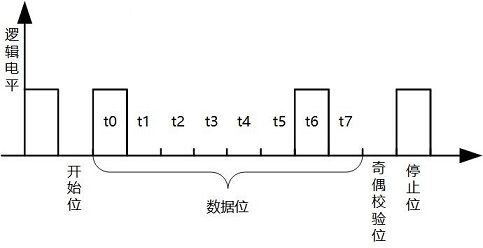
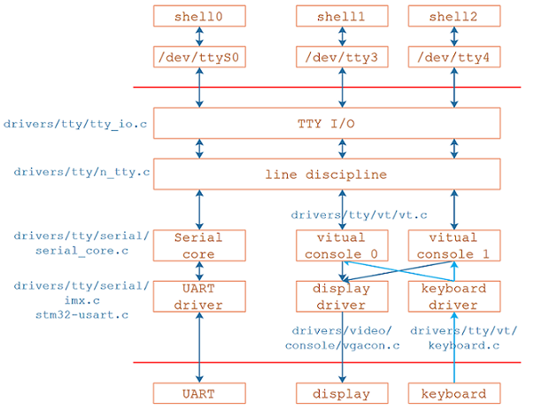
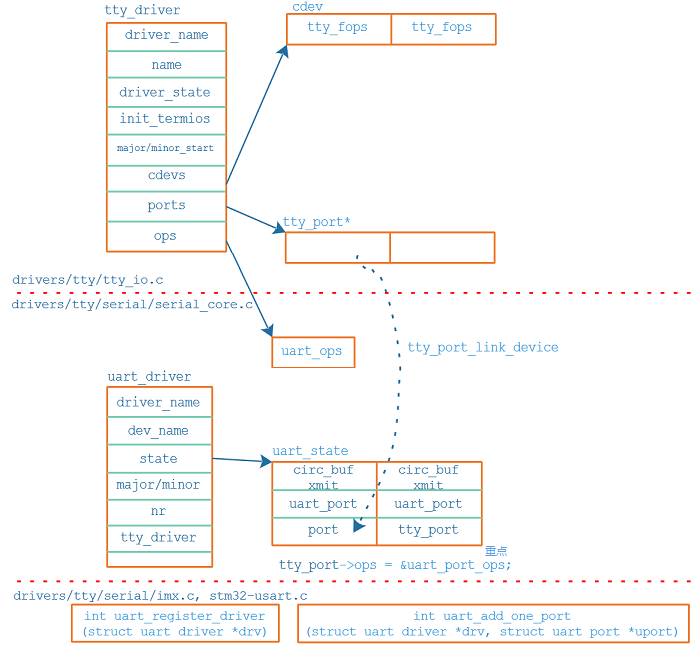
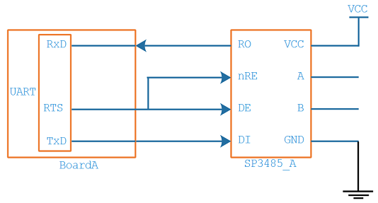

参考资料

* [解密TTY](https://www.cnblogs.com/liqiuhao/p/9031803.html)

* [彻底理解Linux的各种终端类型以及概念](https://blog.csdn.net/dog250/article/details/78766716)

* [Linux终端和Line discipline图解](https://blog.csdn.net/dog250/article/details/78818612)

* [What Are Teletypes, and Why Were They Used with Computers?](https://www.howtogeek.com/727213/what-are-teletypes-and-why-were-they-used-with-computers/)

* [Serial Programming Guide for POSIX Operating Systems](https://digilander.libero.it/robang/rubrica/serial.htm)

* [Linux串口—struct termios结构体](https://www.cnblogs.com/sky-heaven/p/9675253.html)

* [Linux串口编程](https://www.cnblogs.com/feisky/archive/2010/05/21/1740893.html)：有参考代码


## 1. tty协议及基本概念




| 设备节点                            | 含义                                                         |
| ----------------------------------- | ------------------------------------------------------------ |
| /dev/ttyS0、/dev/ttySAC0            | 串口                                                         |
| /dev/tty1、/dev/tty2、/dev/tty3、…… | 虚拟终端设备节点                                             |
| /dev/tty0                           | 前台终端                                                     |
| /dev/tty                            | 程序自己的终端，可能是串口、也可能是虚拟终端                 |
| /dev/console                        | 控制台，权力更大，由内核的cmdline参数确定，cat /proc/cmdline |

* 无论console为何值，内核的打印信息都是由前台虚拟中断打印出来的，系统启动后，/dev/console才会根据console的参数对应到其他设备

```mermaid
flowchart LR
	RXD-->接收移位器-->接收FIFO-->PerpheralBUS
	PerpheralBUS-->发送FIFO-->发送移位器-->TXD
```

## 2. Linux串口应用编程

* open
* 设置行规程，比如波特率、数据位、停止位、检验位、RAW模式、一有数据就返回
* read/write

行规程的参数用结构体termios来表示，可以参考[Linux串口—struct termios结构体](https://blog.csdn.net/yemingzhu163/article/details/5897156)，可用下列函数设置参数：

| 函数名:tc(terminal contorl)&cf(control flag) | 作用                                      |
| -------------------------------------------- | ----------------------------------------- |
| tcgetattr                                    | get terminal attributes，获得终端的属性   |
| tcsetattr                                    | set terminal attributes，修改终端参数     |
| tcflush                                      | 清空终端未完成的输入/输出请求及数据       |
| cfsetispeed                                  | sets the input baud rate，设置输入波特率  |
| cfsetospeed                                  | sets the output baud rate，设置输出波特率 |
| cfsetspeed                                   | 同时设置输入、输出波特率                  |

示例代码： [serial_send_recv.c](..\code\uart\serial_send_recv.c)  [gps_read.c](..\code\uart\gps_read.c) 

## 3. 字符驱动新的注册方法

```c
struct cdev xxx_cdev;
static int __init xxx_init(void)
{
    int rc;
    dev_t devid;
    int major;
    /* 有主设备号：register_chrdev_region, 无主设备号：alloc_chrdev_region */
    rc = alloc_chrdev_region(&devid, 0, 1, "devname");	/* 分配cdev */
    major = MAJOR(devid);
    cdev_init(&xxx_cdev, &xxx_fpos);	/* 设置cdev */
    cdev_add(&xxx_cdev, devid, 1);		/* 注册cdev */
}
static void __exit xxx_exit(void)
{
    cdev_del(&xxx_cdev);
    unregister_chrdev_region(MKDEV(major,0), 1);
}
```
## 4.uart子系统情景分析

### 4.1 驱动框架



### 4.2 注册过程分析



### 4.3 UART驱动情景分析_open

* 找到tty_driver

  * 分配/设置tty_struct
  * 行规程相关的初始化

* 调用tty_driver->ops->open              // ops是struct tty_operations指针类型, 就是uart_open

  * tty_port_open // uart下有多个port, 下面就是打开某个port
    * port->ops->activate(port, tty); // ops是struct tty_port_operations指针类型
      * uart_startup(tty, state, 0);
        * uart_port_startup(tty, state, init_hw);
          * 调用uart_port->ops->startup   // ops是struct uart_ops指针类型

### 4.4 UART驱动情景分析_read

* 行规程注册

```c
void __init n_tty_init(void)
{
	tty_register_ldisc(N_TTY, &n_tty_ops);
}
```

以后可以通过标号N_TTY找到这个行规程。

* open设备时确定行规程

```c
tty_open
    tty_open_by_driver
    	tty_init_dev
    		tty = alloc_tty_struct(driver, idx);
					tty_ldisc_init(tty);
						struct tty_ldisc *ld = tty_ldisc_get(tty, N_TTY);
						tty->ldisc = ld;
```

* read过程分析
  * APP读，使用行规程来读，无数据则休眠
  * UART接收到数据，产生中断，中断程序从硬件上读入数据
  * 发给行规程，行规程处理后存入buffer，行规程唤醒APP
  * APP被唤醒后，从行规程buffer中读入数据，返回

```c
tty_read
    ld->ops->read(tty, file, buf, count);//n_tty_ops->read,即n_tty_read
		timeout = wait_woken(&wait, TASK_INTERRUPTIBLE, timeout);//没有则休眠
		uncopied = copy_from_read_buf(tty, &b, &nr);	//唤醒后读数据
			const unsigned char *from = read_buf_addr(ldata, tail);
			retval = copy_to_user(*b, from, n);
```

* 数据源头：imx6ull为例`drivers\tty\serial\imx.c`

```c
imx_rxint
    // 读取硬件状态
    // 得到数据
    // 在对应的uart_port中更新统计信息, 比如sport->port.icount.rx++;
    // 把数据存入tty_port里的tty_buffer
    tty_insert_flip_char(port, rx, flg) //对于dma可能就是tty_insert_flip_string
    // 通知行规程来处理
    tty_flip_buffer_push(port);
    	tty_schedule_flip(port);
			queue_work(system_unbound_wq, &buf->work); // 使用工作队列来处理
				// 对应flush_to_ldisc函数
```

### 4.5 UART驱动情景分析_write

* write过程分析
  * APP写，使用行规程来写，数据最终存入uart_state->xmit的buffer里
  * 硬件发送：使用硬件驱动中uart_ops->start_tx开始发送（具体的发送方法有2种：通过DMA，或通过中断）
  * 对于中断方式
    * 方法1：直接使能 tx empty中断，一开始tx buffer为空，在中断里填入数据
    
    * 方法2：写部分数据到tx fifo，使能中断，剩下的数据再中断里继续发送
    
```c
tty_write
    ret = do_tty_write(ld->ops->write, tty, file, buf, count);//ld->ops->write对应n_tty_write
		c = tty->ops->write(tty, b, nr);//ops对应struct tty_operations的uart_ops，write就是uart_write
			circ = &state->xmit;					//先把数据存入xmit buffer
			memcpy(circ->buf + circ->head, buf, c);	//
			__uart_start(tty);	//然后启动串口发送数据
				port->ops->start_tx(port);	//ops对应硬件驱动提供的struct uart_ops*，对于imx则是imx_start_tx
imx_start_tx
    writel(temp | UCR1_TXMPTYEN, sport->port.membase + UCR1);//走非dma分支分析，设置发送fifo为空则产生中断，中断函数为imx_txint
imx_txint
    imx_transmit_buffer(sport);
		writel(xmit->buf[xmit->tail], sport->port.membase + URTX0);//发送fifo没满时，从xmit buffer中取出数据写入FIFO
		xmit->tail = (xmit->tail + 1) & (UART_XMIT_SIZE - 1);
		sport->port.icount.tx++;	//更新统计数据
```

## 5. UART驱动调试方法

### 5.1 proc文件

* /proc/interrupts(查看发生中断次数)

* /proc/tty/drivers(查看支持哪些设备)

* /proc/tty/driver(查看统计信息)(非常有用)

* /proc/tty/ldiscs(查看有哪些行规程)

### 5.2 sys文件

`static DEVICE_ATTR(type, s_IRUSR | S_IRGRP, uart_get_attr_type, NULL);`由以上宏定义去推到sys

```shell
cd /sys
find -name uartclk  // 就可以找到这些文件所在目录
```

## 6. 虚拟UART驱动


创建一个虚拟文件：/proc/virt_uart_buf

* 要发数据给虚拟串口时，执行：echo "xxx" > /proc/virt_uart_buf
* 要读取虚拟串口的数据时，执行：cat /proc/virt_uart_buf

```c
/ {
    virtual_uart: virtual_uart {
        .compatible = "chipx,virtual_uart";
        interrupt_parent = <&intc>;
        interrupts = <GIC_SPI 99 IRQ_TYPE_LEVEL_HIGH>;
    };
};
```

* 实现/proc文件

```shell
grep "cmdline" * -nr | grep proc
fs/proc/cmdline.c:26:   proc_create("cmdline", 0, NULL, &cmdline_proc_fops);#参考
```

* 示例代码  [virtual_uart.c](..\code\uart\virtual_uart.c) 

## 7.printk


* 涉及到的宏

```c
/* include/linux/kernel.h */
#define KERN_SOH	"\001"		/* ASCII Start Of Header前导字符 */
#define KERN_SOH_ASCII	'\001'
#define KERN_EMERG	KERN_SOH "0"	/* system is unusable */
#define KERN_ALERT	KERN_SOH "1"	/* action must be taken immediately */
#define KERN_CRIT	KERN_SOH "2"	/* critical conditions */
#define KERN_ERR	KERN_SOH "3"	/* error conditions */
#define KERN_WARNING	KERN_SOH "4"	/* warning conditions */
#define KERN_NOTICE	KERN_SOH "5"	/* normal but significant condition */
#define KERN_INFO	KERN_SOH "6"	/* informational */
#define KERN_DEBUG	KERN_SOH "7"	/* debug-level messages */

#define console_loglevel (console_printk[0])	//消息级别值小于该值才会被打印
#define default_message_loglevel (console_printk[1])
#define minimum_console_loglevel (console_printk[2])
#define default_console_loglevel (console_printk[3])
```

* 在用户空间修改printk函数的记录级别

```shell
# echo "1 4 1 7" > /proc/sys/kernel/printk
console_loglevel          default_message_loglevel  minimum_console_loglevel   default_console_loglevel
控制台消息级别小于该值才会打印  默认的消息级别
```

* 命令行参数

```shell
$ cat /proc/cmdline
console=ttymxc0,115200 root=/dev/mmcblk1p2 rootwait rw
#在设备树中可以修改
/ {
	chosen {
		bootargs = "console=ttymxc1,115200";
    };
};
```

* 函数调用过程

```c
printk
    // linux 4.9: kernel/printk/internal.h or linux 5.4: kernel/printk/printk_safe.c
    vprintk_func 
    	vprintk_default(fmt, args);
			vprintk_emit
                vprintk_store // 把要打印的信息保存在log_buf中<==
                	log_output
                
                preempt_disable();
                if (console_trylock_spinning())
                    console_unlock();
                preempt_enable();
console_unlock
	for (;;) {
        msg = log_from_idx(console_idx);
        if (suppress_message_printing(msg->level)) {
            /* 如果消息的级别数值大于console_loglevel, 则不打印此信息 */
        }
    	printk_safe_enter_irqsave(flags);
		call_console_drivers(ext_text, ext_len, text, len);
        	on->write(con, text, len);
		printk_safe_exit_irqrestore(flags);
    }
```

## 8. Console

### 8.1 Console结构体

```c
struct console {
	char	name[16];  // name为"ttyXXX"，在cmdline中用"console=ttyXXX0"来匹配
    // 输出函数
	void	(*write)(struct console *, const char *, unsigned);    
	int	    (*read)(struct console *, char *, unsigned);
    // APP访问/dev/console时通过这个函数来确定是哪个(index)设备，e.g.
    // a. cmdline中"console=ttymxc1"
    // b. 则注册对应的console驱动时：console->index = 1
    // c. APP访问/dev/console时调用"console->device"来返回这个index
	struct  tty_driver *(*device)(struct console *co, int *index);
	void	(*unblank)(void);
    // 设置函数, 可设为NULL
	int	    (*setup)(struct console *, char *);
    // 匹配函数, 可设为NULL
	int	    (*match)(struct console *, char *name, int idx, char *options); 
    // flags分两种bootconsoles以及real consoles前者打印早期信息，可以有很多种，后者才是真正的console，若定义或者，前者失效且无法注册
	short	flags;
    // 哪个设备用作console: 
    // a. 可以设置为-1, 表示由cmdline确定
    // b. 也可以直接指定
	short	index;
    // 常用: CON_PRINTBUFFER
	int	    cflag;
	void	*data;
	struct	 console *next;
};
```

### 8.2 Console驱动注册过程

* **处理命令行参数**

在`kernel\printk\printk.c`中，可以看到如下代码：

```c
__setup("console=", console_setup);
```

对于带有两个console的选项"console=xxx"就会调用console_setup函数两次，构造得到2个数组项：

```c
//在cmdline中，最后的"console=xxx"就是"selected_console"(被选中的console，对应/dev/console)：
static struct console_cmdline console_cmdline[MAX_CMDLINECONSOLES];
struct console_cmdline
{
	char	name[16];			/* Name of the driver	    */
	int	index;				/* Minor dev. to use	    */
	char	*options;			/* Options for the driver   */
#ifdef CONFIG_A11Y_BRAILLE_CONSOLE
	char	*brl_options;			/* Options for braille driver */
#endif
};
```

* **register_console**

```c
uart_add_one_port
    uart_configure_port
    	register_console(port->cons);
```

* **/dev/console**

```c
tty_open
    tty = tty_open_by_driver(device, inode, filp);
		driver = tty_lookup_driver(device, filp, &index);
			case MKDEV(TTYAUX_MAJOR, 1): {
                struct tty_driver *console_driver = console_device(index);
/* 从console_drivers链表头开始寻找
 * 如果console->device成功，就返回它对应的tty_driver
 * 这就是/dev/console对应的tty_driver
 */ 
struct tty_driver *console_device(int *index)
{
	struct console *c;
	struct tty_driver *driver = NULL;
	console_lock();
	for_each_console(c) {
		if (!c->device)
			continue;
		driver = c->device(c, index);
		if (driver)
			break;
	}
	console_unlock();
	return driver;
}
```

### 8.2 虚拟uart补充console

* 示例代码  [virtual_uart_console.c](..\code\uart\virtual_uart_console.c) 

## 9. 早期打印

* 核心思想，较早的register_console

* early_printk：自己实现write函数，不涉及设备树，简单明了

* earlycon(新)：通过设备树或cmdline指定寄存器地址即可。

* 如果cmdline中只有"earlycon"，不带更多参数：对应`early_init_dt_scan_chosen_stdout`函数

  * 使用"/chosen"下的"stdout-path"找到节点

  * 或使用"/chosen"下的"linux,stdout-path"找到节点

  * 节点里有"compatible"和"reg"属性

    * 根据"compatible"找到`OF_EARLYCON_DECLARE`，里面有setup函数，它会提供write函数
    * write函数写什么寄存器？在"reg"属性里确定

* 如果cmdline中"earlycon=xxx"，带有更多参数：对应`setup_earlycon`函数

  * earlycon=xxx格式为：

    ```shell
    <name>,io|mmio|mmio32|mmio32be,<addr>,<options>
    <name>,0x<addr>,<options>
    <name>,<options>
    <name>
    ```

  * 根据"name"找到`OF_EARLYCON_DECLARE`，里面有setup函数，它会提供write函数

  * write函数写什么寄存器？在"addr"参数里确定

## 10. RS485

* 参考 Linux 4.9.88`Documentation\serial\serial-rs485.txt` Linux 5.4`Documentation\driver-api\serial\serial-rs485.rst`


通常uart子系统会使用RTS(Request to send)引脚当作读写控制引脚，这个引脚可以是gpio也可以是uart自带



在使用RS485发送数据前，把RTS设置为高电平就可以。通过`serial_rs485`结构体控制RTS，示例代码: [rs485_usr.c](..\code\uart\rs485_usr.c) 。

若驱动程序足够完善，则无需在应用层设置RTS。

## 11. 常见问题

配置设备树报-28错误

CONFIG_SERIAL_8250_NR_UARTS=2	//8250/16550串行端口的最大数量

CONFIG_SERIAL_8250_RUNTIME_UARTS=4 //运行时要注册的8250/16550串行端口数
