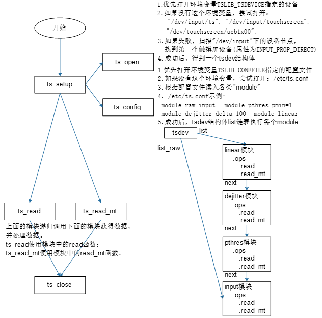
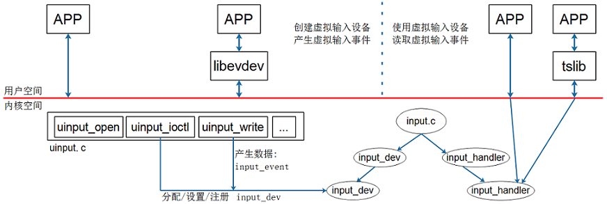

参考资料

* Linux 5.x内核文档，Documentation\input\input-programming.rst & Documentation\input\event-codes.rst
* Linux 4.x内核文档，Documentation\input\input-programming.txt & Documentation\input\event-codes.txt

## 1. 应用层

### 1.1 调试相关
* 获取输入设备及一些信息

```shell
$ cat /proc/bus/input/devices
I: Bus=0018 Vendor=dead Product=beef Version=28bb <=id, struct input id内容
N: Name="goodix-ts" <=设备名称
P: Phys=input/ts <=物理路径
S: Sysfs=/devices/virtual/input/input1 
U: Uniq=
H: Handlers=event1 evbug <=与设备关联的输入句柄列表
B: PROP=2 <=设备属性，B开头为位图
B: EV=b <=支持事件类型，b-1001，即EV_SYN、EV_KEY、EV_ABS
B: KEY=1c00 0 0 0 0 0 0 0 0 0 0 <=此设备具有的键/按钮
B: ABS=6e18000 0
```

* 分析数据

```shell
$ hexdump /dev/input/event1
0000060 5734 0000 c280 000c 0000 0000 0000 0000
0000070 5735 0000 4c60 0000 0003 0039 ffff ffff
_______ _________ _________ ____ ____ _________
  序号      秒        微秒    type code   value
```

### 1.2 tslib

* 交叉编译方法

```shell
$ ./configure --host=arm-linux-gnueabihf  --prefix=/
$ make
$ make install DESTDIR=$PWD/tmp
cp  /mnt/tslib-1.21/tmp/lib/*so*  -d     /lib
cp  /mnt/tslib-1.21/tmp/bin/*            /bin
cp  /mnt/tslib-1.21/tmp/etc/ts.conf  -d  /etc
```

* 框架



* 示例代码  [mt_cal_distance.c](code\input\mt_cal_distance.c) 

## 2. Input子系统框架

* 总框架


* 重要数据结构

```c
struct input_dev {
	const char *name;
	const char *phys;
	const char *uniq;
	struct input_id id;
	...
	unsigned long propbit[BITS_TO_LONGS(INPUT_PROP_CNT)];	//属性
	unsigned long evbit[BITS_TO_LONGS(EV_CNT)];				//支持哪类事件？key/rel/abs?
	unsigned long keybit[BITS_TO_LONGS(KEY_CNT)];			//支持按键的话，支持哪些按键
	unsigned long relbit[BITS_TO_LONGS(REL_CNT)];			//支持相对位移的话，支持哪些
	unsigned long absbit[BITS_TO_LONGS(ABS_CNT)];			//支持绝对位移的话，支持哪些
	...
	struct list_head	h_list;
	struct list_head	node;
}
```


* 子系统框架


* input_handler解析


* 必须的操作

```c
//在中断里，上报数据
void input_event(struct input_dev *dev, unsigned int type, unsigned int code, int value);		 
void input_sync(struct input_dev *dev); // 实质也是 input_event
//一定要设置属性位，这样tslib可以自动找到设备
__set_bit(INPUT_PROP_DIRECT, g_input_dev->propbit);
```

* 示例代码   [touchscreen_qemu.c](code\input\touchscreen_qemu.c)   [touchscreen_qemu.dts](code\input\touchscreen_qemu.dts) 

## 3. gpio-keys驱动

### 3.1 gpio_keys驱动

* 配置设备树即可

```c
gpio-keys {
	compatible = "gpio-keys";	//必须
    autorepeat;	//可选，表示连按
	user2 {
		label = "User2 Button";
		gpios = <&gpio4 14 GPIO_ACTIVE_LOW>;	//与interrupt二选一
		//interrupt-parent = <&gpio4>;			//由此出现两个isr,gpio_keys_irq_isr,gpio_keys_gpio_isr
		//interrupts = <14 IRQ_TYPE_EDGE_RISING>;//前者无法判断按键松放，都是一起上报
		gpio-key,wakeup;
        debounce-interval = 5; //可选，去抖间隔，单位ms
		linux,code = <KEY_2>;
	};
};
```

### 3.2 goodix驱动

```c
i2c@00000000 {	//对应i2c控制器下挂载节点
	gt928@5d {
		compatible = "goodix,gt928";
		reg = <0x5d>;
		interrupt-parent = <&gpio>;
		interrupts = <0 0>;

		irq-gpios = <&gpio1 0 0>;
		reset-gpios = <&gpio1 1 0>;
        touchscreen-max-id = <5>;
		touchscreen-size-x = <1024>;
		touchscreen-size-y = <600>;
	};
};
```

## 4. UInput(可用户态创建的虚拟input_dev)

uinput是一个内核模块(驱动)，它允许应用程序模拟输入设备(input_dev)。应用程序通过访问`/dev/uinput`或`/dev/input/uinput`：

* 创建一个虚拟的输入设备
* 设置它的属性
* APP发送数据给它，让它产生输入事件
* uinput就会把这些输入事件分发给其他使用者(APP或内核里其他模块)

框图如下：



* 配置内核：

```shell
-> Device Drivers
  -> Input device support
    -> Generic input layer   
      -> Miscellaneous devices
         <M>   User level driver support
```

* 示例代码  [uinput_test.c](code\input\uinput_test.c) 

